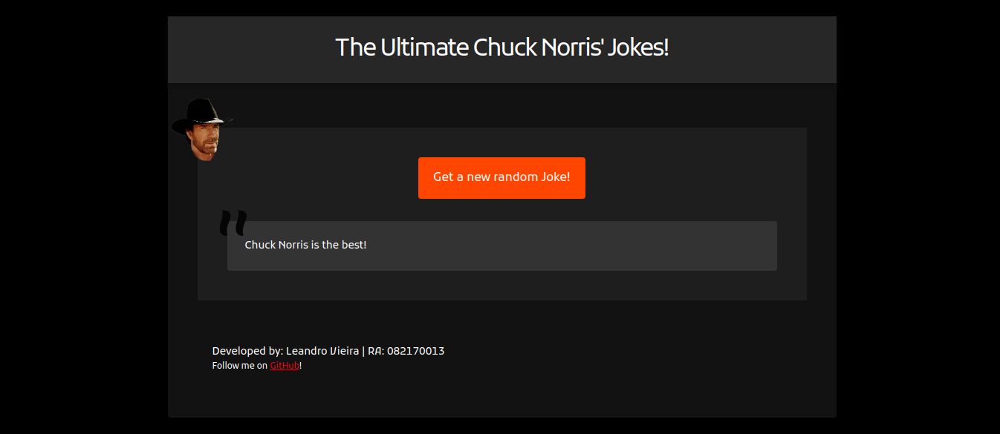

<h3 align="center">
    
</h3>

<h1 align="center"></h1>

<h3 align="center">
  Chuck Norris Jokes!
</h3>

<p align="center">
  

  

  

  

  <a href="https://github.com/leandrovi/chuck-norris-jokes/commits/master">
    
  </a>
</p>

<p align="center">
  <a href="#rocket-sobre">Sobre</a>&nbsp;&nbsp;&nbsp;|&nbsp;&nbsp;&nbsp;
  <a href="#wrench-stack-e-tools">Stack utilizada</a>&nbsp;&nbsp;&nbsp;|&nbsp;&nbsp;&nbsp;
  <a href="#arrow-forward-execuçao">Execução</a>&nbsp;&nbsp;&nbsp;|&nbsp;&nbsp;&nbsp;
  <a href="#memo-licença">Licença</a>
</p>

## :rocket: Sobre

Bem vindos à essa brincadeira sobre piadas do Chuck Norris! 

Este desafio foi proposto pelo Prof. Mestre [Daniel Carvalho](https://github.com/danielscarvalho) na disciplina de Linguagem de Programação III da **FTT**.

O objetivo do desafio era construir uma aplicação simples, utilizando HTML, CSS e JavaScript, para testar um pouco da **fetch api**.

### Tela da Aplicação



O resultado final pode ser visto [nesse link](https://leandrovi-chuck-norris-jokes.netlify.app).

## :wrench: Stack e Tools

- [HTML](https://www.w3schools.com/html/)
- [CSS](https://www.w3schools.com/css/)
- [JavaScript](https://www.w3schools.com/js/)
- [Chuck Norris Jokes API](https://api.chucknorris.io)

## :arrow_forward: Execução

Para executar a aplicação, é necessário somente ter um ambiente contendo:

- Editor de texto
- Browser para rodar a aplicação
- De preferência, uma extensão de Live Server

Em seguida, siga o passo-a-passo:

1. Clone este repositório
```bash
$ git clone https://github.com/leandrovi/chuck-norris-jokes chuckNorrisJokes
```

2. Abra a pasta do projeto e execute o arquivo html em um browser, ou

3. Abra o projeto em seu editor de texto e execute o Live Server

## :memo: Licença

Esse projeto está sob a licença MIT.

---

Feito com ♥ by [leandrovi](https://github.com/leandrovi) :wave: [Get in touch!](https://www.linkedin.com/in/leandrofv/)